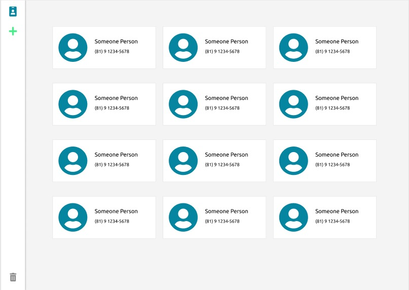
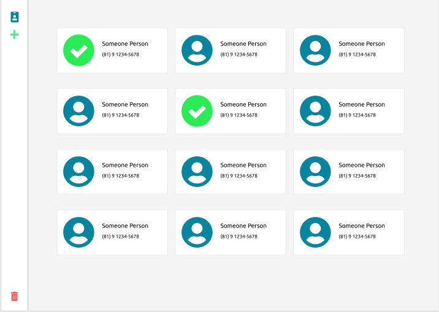

<h1>
  :bulb: Contatos
</h1>
<p align="center">
  
  
</p>

### :computer: Tecnologias utilizadas

- ExpressJS
- Sequelize
- PostgreSQL
- SQLite
- ReactJS
- React Dropzone
- NodeJs
- Typescript
- TDD

### :memo: Como usar

De primeira mão, clone este repositório dentro da sua máquina

```
  git clone https://github.com/leandro-wrf/list-contacts.git
```

No backend, que está armazenado dentro da pasta 'server'
você irá precisar executar os seguintes comandos

```
  # instale as dependencias
  
  cd server && yarn

  # para conseguir rodar as migrations
  # você terá que ter algum banco de dados POSTGRESQL
  # instalado em sua máquina
  # você pode fazer alterações relacionados a porta e nome do banco de dados
  # neste arquivo 'server/src/config/database.js'

  # agora rode as migrations
  
  yarn sequelize db:migrate

  # para rodar os testes, você só precisa rodar este comando
  # acredito que no windows, seja necessário ter o sqlite instalado por padrão, como utilizando debian,
  #não saberei informa, mas logo quando iniciar os testes que ele tentar rodar as migrations irá gerar algum erro
  
  yarn test

  # para inicar o servidor, rode este comando
  
  yarn dev
```

Agora vamos inicializar o web, localizado na outra pasta
chamada 'web'

```
  # instale as dependencias
  cd web && yarn

  # agora inicie o web
  yarn start
```
<p align="justify">
  Os testes automizados do frontend, ainda estou pensando em como aplicar, estou estudando sobre o assunto.
</p>
<p align="justify">
  Por este motivo que o ambiente do ReactJS já está configurado, porém ainda não está funcional.
</p>


### :memo: Minhas experiências

<p align="justify">
  Olá a quem está lendo este readme, o projeto ainda não está finalizado, ficou faltando acrescentar paginação e um botão que deseleciona todos os contatos, irei implementar no decorrer da semana.
</p>
<p align="justify">
  Encontrei dificuldades dentro do projeto web, por motivos, como a falta de costume, você vai poder vê que o projeto não se encontra bem desacoplado a estrutra de arquivos.
</p>
<p align="justify">
  O css da aplicação ficou como eu esperava, todos os detalhes que eu quis implementar foram feitos, ficou faltando um detalhe, que deixa o design da aplicação responsivo para cade resolução de tela diferente, irei aplicar isso ainda está semana. Como um desafio extra, para aumentar meu conhecimento de css, irei implementar na paginação uma animação, digamos que em palavras seria isto 'como se estivesse passando a página de um livro'.
</p>
<p align="justify">
Irei modificar este README durante a semana para ir atualizando o decorrer de como vai aplicação até está ser 100% finalizada.
</p>
<p align="justify">
  Este projeto foi criado para uma teste de uma entrevista, mas talvez se torne não apenas para mim, como para você que está lendo uma fonte legal de como melhorar aos poucos o projeto e implementar coisas novas. 
</p>
<p align="justify">
  Sobre o backend não tenho muito o que falar, é uma estrutura que conheço bem, tenho um domínio maior, não me sinto perdido e acredito ter deixado um ótimo projeto.
</p>
<p align="justify">
  Porém não descarto a questão de que talvez possa ser melhor estruturado, para meu nível de conhecimento atual vejo uma ótima estrutura de código no backend, para o frontend, noto está faltando isto. Então irei revisar um pouco sobre este assunto e ir melhorando aos poucos.
</p>

### :pencil: Funcionalidades extras
- [ ] Paginação
- [ ] Botão que desmarca todos os contatos selecionados
- [ ] Animação na paginação 

### :memo: Licença

Licença MIT.
